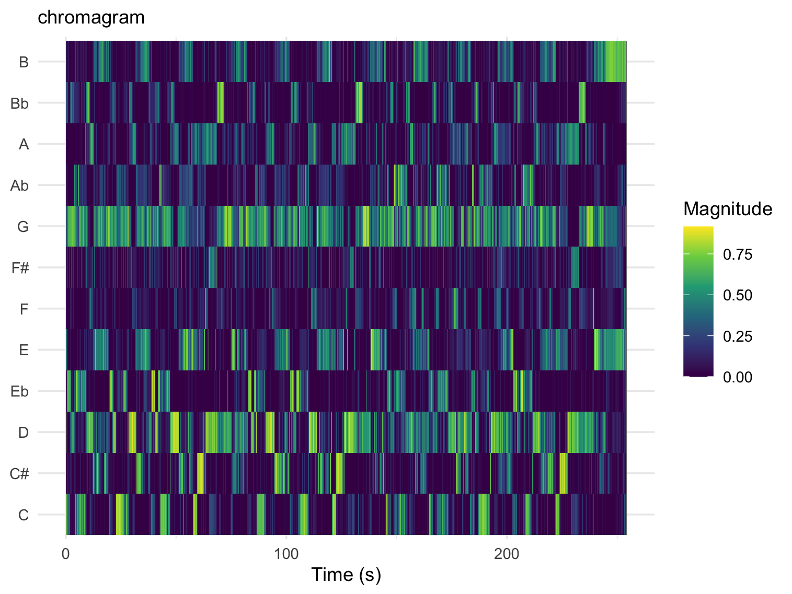
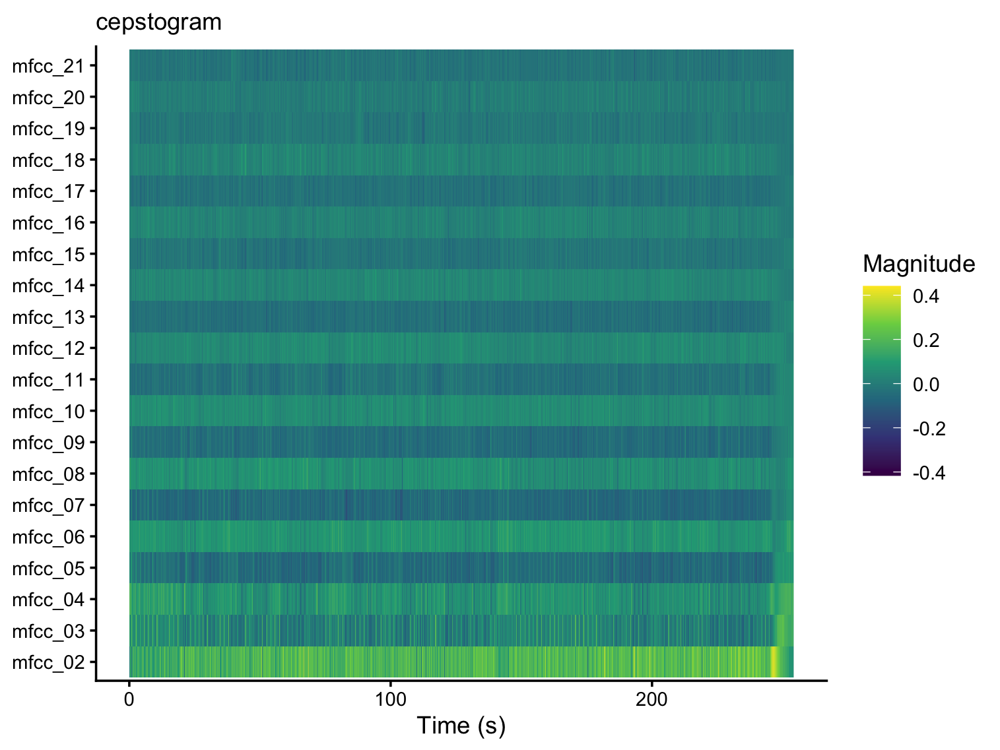
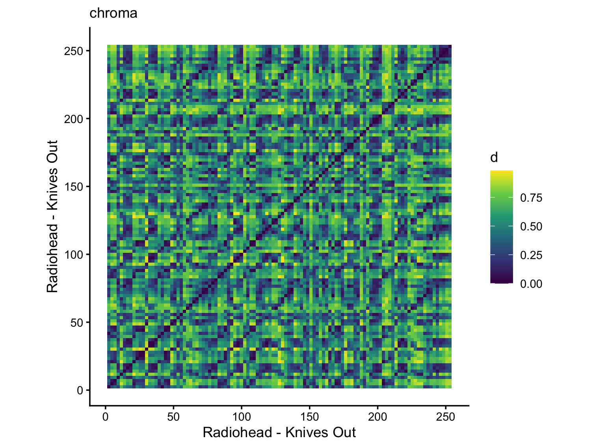
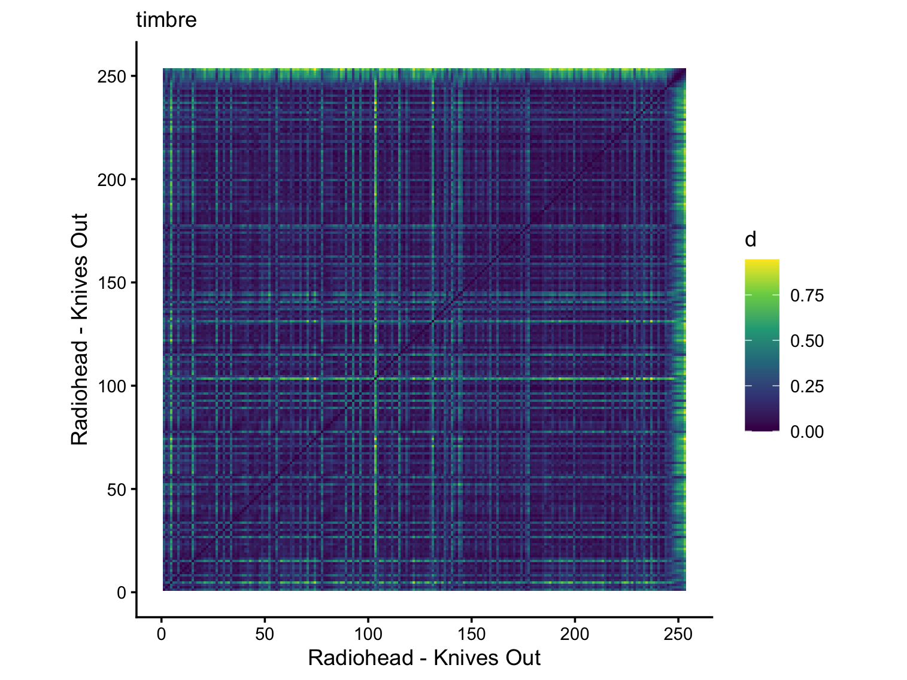

### Structure Analysis + Self-Similarity Matrices

The object of this study is [**Radiohead - Knives Out (2001)**](https://www.youtube.com/watch?v=2Lpw3yMCWro&list=RD2Lpw3yMCWro). Several operations have been performed. In particular, two temporal features: *(1)* **a chromatic analysis**, in which pitch information was charted in time; *(2)* **a timbre analysis**, which charts mel-frequencies information in time. The other part covers temporal self-similarity by utilizing **self-similarity matrices** for *(3)* **chromatic** features, and *(4)* **timbre-based** features.

### Radiohead - Knives Out

 
   
   

(1) *G* is consistently strong that suggests it's being the tonal center.

 
   
   

(3) the diagonal lines are strong, suggesting quite similar, recurring sections. 
(4) the checkerboard pattern is particularly present, suggesting an abundance of recurring sections. 